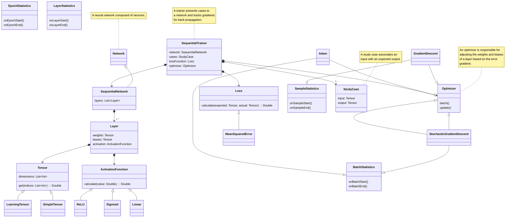
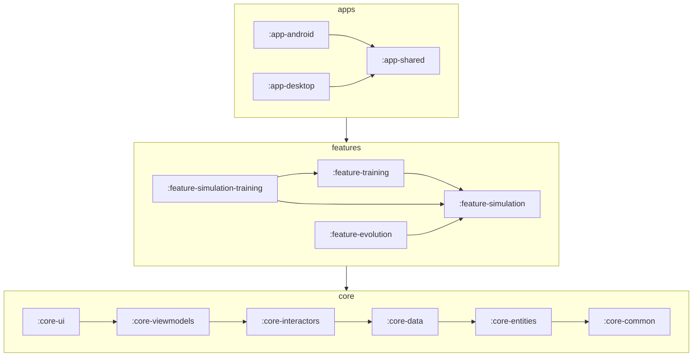

# Disco
This project started as a small attempt to recreate some machine learning primitives from 
scratch in Kotlin.
I quickly realized while doing research that I could fairly easily build a small set of primitives
to build larger components and scale up complexity rapidly. At the same time that I was
learning about different optimization and visualization techniques for my own use, I realized
they would make fantastic learning tools for others as well.

Related: https://github.com/Pointyware/AI-Licensing

## ML Primitives

| Category             | Name                          | Description                                                                                                     |
|----------------------|-------------------------------|-----------------------------------------------------------------------------------------------------------------|
| Tensors              | Pools                         | Pools to store and reuse tensors by dimension                                                                   |
| Activation Functions | ReLU                          | Rectified Linear Unit                                                                                           |
|                      | Logistic                      | Often referred to as "the sigmoid"                                                                              |
|                      | Tanh                          | Hyperbolic tangent                                                                                              |
|                      | GELU†                         | Gaussian Error Linear Unit                                                                                      |
|                      | Swish†                        | Linear interpolation between linear and ReLU                                                                    |
|                      | SwiGLU†                       | Swish-based Gated Linear Unit                                                                                   |
| Regularizers         | RMSNorm                       | Normalizes each input by the root-mean-squared across all inputs                                                |
|                      | LayerNorm†                    |                                                                                                                 |
| Layers               | Dense                         | Linear (Fully Connected)                                                                                        |
|                      | Convolutional†                |                                                                                                                 |
| Networks             | Sequential Networks           | Networks composed entirely of layers, each receiving a single input from the previous layer                     |
|                      | Residual Networks             | Layer-based networks that allow skip connections                                                                |
| Cost/Loss Functions  | Mean Squared Error            |                                                                                                                 |
|                      | Cross Entropy Loss            | Converts the output predictions to                                                                              |
| Optimizers           | Gradient Descent              | Computes gradients across all samples before updating parameters.                                               |
|                      | Stochastic (Gradient Descent) | Computes gradients across stochastically selected samples before updating parameters.                           |
|                      | Adam†                         | Momentum-based; performs multiple passes over samples and parameter updates in a single epoch                   |
| Training             | Sequential Trainer            | Trainer for a Sequential Network                                                                                |
|                      | AutoDiff Trainer              | Trainer for any network that produces a computation graph.                                                      |
|                      | Organic Trainer†              | Trainer that modifies a network according to statistics; mimics neurogenesis and ablation at alternating stages |

† - Planned/Experimental

## Project Structure

The structure of this project is based on Clean Architecture applied to Android's MVVM architecture.
UI and Data implementations occupy the outermost frameworks/drivers layer. ViewModels, 
Repository Implementations, Data Source interfaces and occupy the adapter/interfaces layer. 
Interactors and Repository interfaces occupy the application business layer.
Entities occupy the enterprise business layer.

## Research Citations
1. Ashish Vaswani, Noam Shazeer, Niki Parmar, Jakob Uszkoreit, Llion Jones, Aidan N. Gomez, Lukasz Kaiser, Illia Polosukhin. Attention is All You Need. *arXiv preprint arXiv:IDvN*, 2017
2. Ravid Schwartz-Ziv, Naftali Tishby. Opening the Black Box of Deep Neural Networks via Information. *arXiv preprint arXiv:1703.00810v3*, 2017.
3. 
4. Author, Author. Title. *Publication*, Year.
